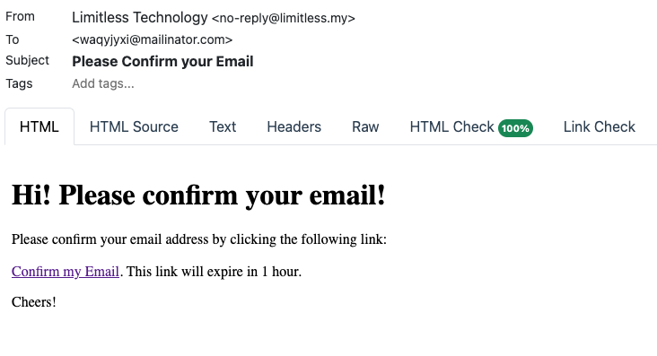

# Part 3

## Scenario

Limitless Technologies is experiencing rapid growth and needs to improve customer experience through a personalized recommendation engine. This engine will analyze user behavior, purchase history, and product attributes to suggest relevant products on product pages and during checkout.

## Task Overview

Develop a scalable and robust backend API for the recommendation engine using the provided technologies. The API should be well-documented and secure.

## Technical Requirements

- [x] **Programming Language**: PHP
- [x] **Framework**: Symfony Framework
- [ ] **Database**: MySQL (hosted on Google Cloud Platform)
- [x] **Version Control System**: Git
- [ ] **API Documentation**: Swagger or OpenAPI

## Functionality (5 Sections)

1. **User Management (Security Focus)**
   - [ ] Users should be able to register and log in securely.
   - [ ] Implement strong password hashing (e.g., bcrypt) and user sessions.
   - [ ] Validate and sanitize user input to prevent SQL injection and XSS vulnerabilities.

2. **Product Management (Data Modeling)**
   - [ ] Design a robust data model for products using Entity-Relationship Modeling (ERM) principles.
   - [ ] Include essential attributes like category, price, description, and consider additional attributes for future recommendations (e.g., brand, size, color).
   - [ ] Implement CRUD (Create, Read, Update, Delete) operations with proper data validation.

3. **Purchase History (Data Persistence)**
   - [ ] Persist user purchase data efficiently, including product information, timestamps, and quantities purchased.
   - [ ] Consider database normalization techniques to avoid data redundancy.

4. **Recommendation Engine (Algorithmic Thinking)**
   - [ ] Design and implement a recommendation algorithm that analyzes user purchase history, product attributes, and potentially other factors (e.g., user demographics, browsing behavior).
   - [ ] Explore collaborative filtering, content-based filtering, or hybrid approaches.
   - [ ] Consider weighting factors to prioritize relevant recommendations.

5. **API Design & Scalability (Architecture & Best Practices)**
   - [ ] Structure the API for clarity and future enhancements.
   - [ ] Implement RESTful principles and utilize proper HTTP status codes.
   - [ ] Consider caching mechanisms and database optimization for scalability.

## Bonus Points

- [ ] **Unit Tests**: Well-written tests covering core functionalities.
- [ ] **Security**: Measures to prevent vulnerabilities beyond basic user authentication.
- [ ] **Logging/Monitoring**: Implementation of tools for troubleshooting and performance analysis.
- [ ] **Scalability Design**: Design patterns and considerations for future growth.

---

## Steps

- [x] Install Twig & Twig Language 2 Extensions for Visual Studio Code

### Registration

Referecences:

- <https://symfony.com/doc/current/security.html#loading-the-user-the-user-provider>

Update the Security Bundle

```bash
composer require symfony/security-bundle
```

Make user entity:

```bash
php bin/console make:user
```

Create the migration:

```bash
php bin/console make:migration
```

Run the migration:

```bash
php bin/console doctrine:migrations:migrate
```

Setting up verify email:

```bash
composer require symfonycasts/verify-email-bundle
```

Setup registration form:

```bash
php bin/console make:registration-form
```

Create dashboard controller, to redirect user after registration:

```bash
php bin/console make:controller DashboardController
```

Then update the redirect route in `RegisterController` to `app_dashboard`.

Run `php bin/console make:migration` to generate a migration for the newly added `User::isVerified` property.

Then run `php bin/console doctrine:migrations:migrate`

In `RegistrationController::verifyUserEmail()`, customize the last `redirectToRoute()` after a successful email verification to `app_dashboard`.

next, make sure you have `mailpit` installed and configured in `.env`:

```plaintext
MAILER_DSN=smtp://127.0.0.1:1025
```

Then run the messenger:

```bash
php bin/console messenger:consume async --time-limit=3600 --memory-limit=128M
```

Then open your browser, go to `/register` to the registration with verify email.

Once you are registered, check mailpit at `http://0.0.0.0:8025` for new registration verification email:

<center>

</center>

Proceed to login if requested. You should be able to verify your account once completed the login.

> Addon: If you try to visit `/register` now, you should be redirect to `/dashboard` instead.
